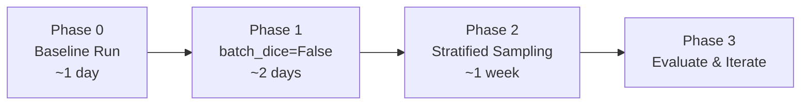
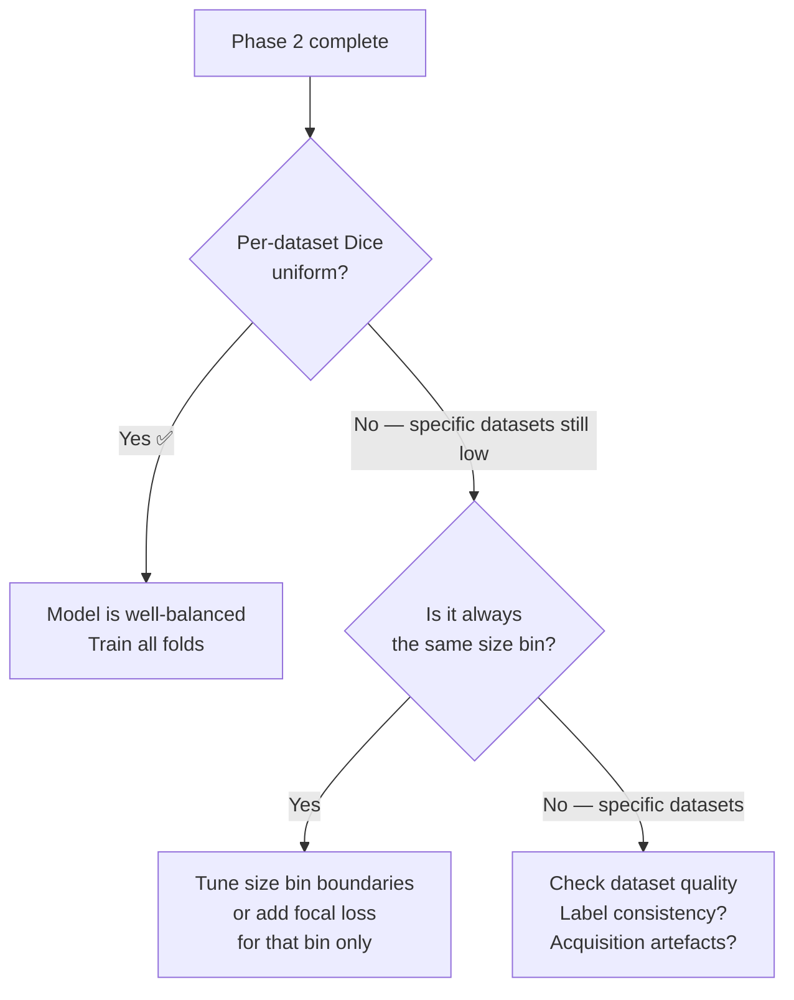

# Training Gameplan — Universal Lesion Segmentation

> **Goal:** Improve variating lesion size detection across 18 datasets by fixing loss dominance and sampling imbalance.  
> **Model:** nnUNetResEncUNetLPlans_h200 · Dataset999 · 3d_fullres · 7000 volumes

---

## 🗺️ Overview



---

## Phase 0 — Establish Baseline

> [!important] Do this first before any changes, so you have a fair comparison point.

- [x] Train vanilla `3d_fullres` fold 0 with current config (`batch_dice=True`)
- [x] Record `best_ema_dice` from wandb
- [x] Run patch inference script → record **Aggregated Dice** and **Foreground Patch Dice**
- [x] Plot fg_voxel histogram across all training cases (see script below)

**Baseline metrics to track:**

| Metric                        | Baseline | After Phase 1 | After Phase 2 |
| ----------------------------- | -------- | ------------- | ------------- |
| best_ema_dice (wandb)         |          |               |               |
| Aggregated Mean FG Dice       |          |               |               |
| Foreground Patch Mean Dice    |          |               |               |
| Per-dataset Dice (each of 18) |          |               |               |

---

## Phase 1 — `batch_dice=False`

> [!note] This is a zero-risk, one-line change. Do it regardless of everything else. Your `3d_lowres` config already has `batch_dice=false` — `3d_fullres` should match.

### Why

With `batch_size=8` and `batch_dice=True`, tp/fp/fn are summed across all 8 patches and all spatial dims. One batch containing a few large liver lesions completely dominates the gradient. Setting `batch_dice=False` gives each of the 8 patches **equal weight** in the loss regardless of lesion size.

### Implementation

Create `nnUNetTrainerNoBatchDice.py` in your trainers folder:

```python
from nnunetv2.training.nnUNetTrainer.nnUNetTrainer import nnUNetTrainer

class nnUNetTrainerNoBatchDice(nnUNetTrainer):
    def _build_loss(self):
        # Get the default loss config and flip batch_dice
        loss = super()._build_loss()
        # Override batch_dice to False
        loss.batch_dice = False
        return loss
```

> [!tip] Double-check how `_build_loss()` constructs the loss in your nnUNet version — the override point may differ slightly. Look for where `batch_dice` is passed to `MemoryEfficientSoftDiceLoss` or `DC_and_CE_loss`.

### Train command

```bash
nnUNetv2_train 999 3d_fullres 0 \
  -tr nnUNetTrainerNoBatchDice \
  -p nnUNetResEncUNetLPlans_h200 \
  --npz --use-wandb
```

### Success criteria

- Foreground Patch Mean Dice improves (`0.35 → 0.50+` would confirm the hypothesis)
- Aggregated Dice stays stable or improves (should not drop significantly)

---

## Phase 2 — Stratified Batch Sampling

> [!note] This tackles the second problem: batches accidentally dominated by one dataset or one lesion size class.

### Why

With 18 heterogeneous datasets, a random batch can easily contain 7 liver cases and 0 thyroid cases. Stratifying by **dataset source** + **lesion size bin** ensures every batch sees a representative mix of your data.

---

### Step 1 — Inspect the fg_voxel distribution

Run this first to pick sensible bin boundaries:

```python
import numpy as np
import matplotlib.pyplot as plt
import json
from pathlib import Path

preprocessed_dir = Path("YOUR_PREPROCESSED_DIR/Dataset999_Merged/nnUNetResEncUNetLPlans_h200_3d_fullres")

fg_counts = []
for npz_file in preprocessed_dir.glob("*.npz"):
    data = np.load(npz_file)
    seg = data['seg']
    fg_counts.append(int((seg > 0).sum()))

plt.figure(figsize=(12, 4))
plt.subplot(1, 2, 1)
plt.hist(fg_counts, bins=100)
plt.xlabel("Foreground voxels")
plt.title("Raw distribution")

plt.subplot(1, 2, 2)
nonzero = [x for x in fg_counts if x > 0]
plt.hist(np.log10(nonzero), bins=100)
plt.xlabel("log10(fg voxels)")
plt.title("Log distribution (foreground only)")

plt.tight_layout()
plt.savefig("fg_voxel_distribution.png")
print(f"Zero-fg cases: {fg_counts.count(0)} / {len(fg_counts)}")
```

> [!tip] The log-scale plot will show natural breakpoints. Pick bin boundaries there, not at arbitrary round numbers.

---

### Step 2 — Precompute case statistics

Run once, reuse every training run:

```python
import numpy as np
import json
from pathlib import Path

preprocessed_dir = Path("YOUR_PREPROCESSED_DIR/Dataset999_Merged/nnUNetResEncUNetLPlans_h200_3d_fullres")

def get_size_bin(fg_voxels):
    # Adjust these thresholds based on your histogram from Step 1
    if fg_voxels == 0:
        return "background"
    elif fg_voxels < 100:
        return "tiny"        # sub-cm nodules
    elif fg_voxels < 2000:
        return "small"
    elif fg_voxels < 20000:
        return "medium"
    else:
        return "large"       # liver masses, large metastases

stats = {}
for npz_file in preprocessed_dir.glob("*.npz"):
    data = np.load(npz_file)
    seg = data['seg']
    fg_voxels = int((seg > 0).sum())
    case_id = npz_file.stem
    # Adjust split logic to match your actual case ID naming convention
    dataset_id = case_id.split('_')[0]
    stats[case_id] = {
        "dataset": dataset_id,
        "fg_voxels": fg_voxels,
        "size_bin": get_size_bin(fg_voxels)
    }

with open("case_stats.json", "w") as f:
    json.dump(stats, f, indent=2)

# Print summary
from collections import Counter
bins = Counter(v['size_bin'] for v in stats.values())
datasets = Counter(v['dataset'] for v in stats.values())
print("Size bin distribution:", dict(bins))
print("Cases per dataset:", dict(datasets))
```

---

### Step 3 — Custom sampler

```python
# stratified_sampler.py
import random
from torch.utils.data import Sampler
from collections import defaultdict

class StratifiedLesionSampler(Sampler):
    """
    Stratifies batches by (dataset_id, size_bin).
    Each batch gets a round-robin mix across all strata.
    Set uniform_datasets=True to sample equally per dataset
    regardless of dataset size (recommended for universal models).
    """
    def __init__(self, case_stats, batch_size, uniform_datasets=True):
        self.batch_size = batch_size
        self.uniform_datasets = uniform_datasets

        # Build strata: (dataset, size_bin) -> [case_ids]
        self.strata = defaultdict(list)
        for case_id, info in case_stats.items():
            stratum = (info['dataset'], info['size_bin'])
            self.strata[stratum].append(case_id)

        self.stratum_keys = list(self.strata.keys())
        self.total_cases = sum(len(v) for v in self.strata.values())

        # Print stratum summary on init
        print(f"Sampler: {len(self.stratum_keys)} strata, "
              f"{self.total_cases} total cases")

    def __iter__(self):
        shuffled = {k: random.sample(v, len(v))
                    for k, v in self.strata.items()}
        pointers = {k: 0 for k in self.stratum_keys}

        n_batches = self.total_cases // self.batch_size
        flat_order = []

        for _ in range(n_batches):
            batch = []
            strata_cycle = random.sample(
                self.stratum_keys, len(self.stratum_keys))

            for stratum in strata_cycle:
                if len(batch) >= self.batch_size:
                    break
                ptr = pointers[stratum]
                cases = shuffled[stratum]
                if ptr < len(cases):
                    batch.append(cases[ptr])
                    pointers[stratum] += 1

            # Pad if needed
            while len(batch) < self.batch_size:
                fallback = random.choice(self.stratum_keys)
                batch.append(random.choice(self.strata[fallback]))

            flat_order.extend(batch)

        yield from flat_order

    def __len__(self):
        return self.total_cases
```

---

### Step 4 — Custom trainer combining both changes

```python
# nnUNetTrainerStratifiedNoBatchDice.py
import json
from nnunetv2.training.nnUNetTrainer.nnUNetTrainer import nnUNetTrainer
from stratified_sampler import StratifiedLesionSampler

class nnUNetTrainerStratifiedNoBatchDice(nnUNetTrainer):

    def _build_loss(self):
        loss = super()._build_loss()
        loss.batch_dice = False
        return loss

    def get_dataloaders(self):
        train_loader, val_loader = super().get_dataloaders()

        with open("case_stats.json") as f:
            case_stats = json.load(f)

        sampler = StratifiedLesionSampler(
            case_stats=case_stats,
            batch_size=self.batch_size,
            uniform_datasets=True   # equal weight per dataset
        )

        # Swap sampler — verify this hook point in your nnUNet version
        train_loader.sampler = sampler

        return train_loader, val_loader
```

> [!warning] nnUNet uses a custom `nnUNetDataLoader` internally, not a standard PyTorch DataLoader. Before running, check how `get_dataloaders()` works in your version — you may need to patch at a deeper level (e.g. override `get_plain_dataloaders()` or the dataloader class directly).

### Train command

```bash
nnUNetv2_train 999 3d_fullres 0 \
  -tr nnUNetTrainerStratifiedNoBatchDice \
  -p nnUNetResEncUNetLPlans_h200 \
  --npz --use-wandb
```

---

## Phase 3 — Evaluate & Iterate

### Per-dataset Dice breakdown

After Phase 2, evaluate Dice **per dataset** not just overall. This is where stratification either proves itself or reveals remaining gaps.

```python
# In your patch inference script, group results by dataset_id
# and report mean Dice per dataset separately
```

### Decision tree



---

## 📋 Checklist

### Phase 0

- [ ] Vanilla baseline trained (fold 0)
- [ ] Baseline metrics recorded in table above
- [ ] fg_voxel histogram plotted

### Phase 1

- [ ] `nnUNetTrainerNoBatchDice.py` created
- [ ] Phase 1 training complete (fold 0)
- [ ] Metrics recorded — foreground patch Dice improved?

### Phase 2

- [ ] Bin thresholds chosen from histogram
- [ ] `case_stats.json` generated
- [ ] Stratum distribution looks reasonable (no empty strata)
- [ ] `stratified_sampler.py` created
- [ ] `nnUNetTrainerStratifiedNoBatchDice.py` created
- [ ] nnUNet dataloader hook point verified
- [ ] Phase 2 training complete (fold 0)
- [ ] Per-dataset Dice breakdown computed

### Phase 3

- [ ] Decision tree evaluated
- [ ] All 5 folds trained with winning config

---

_Tags: #nnUNet #training #lesion-segmentation #universal-model #**gameplan_******